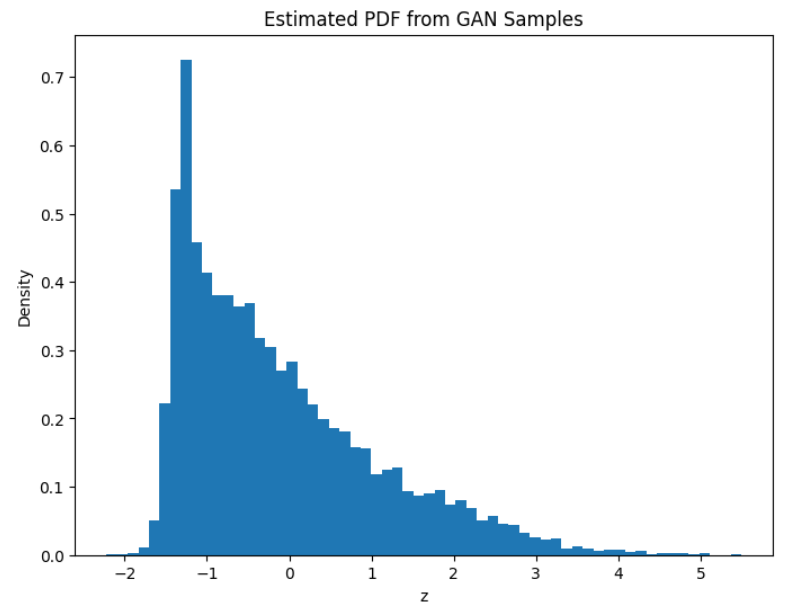
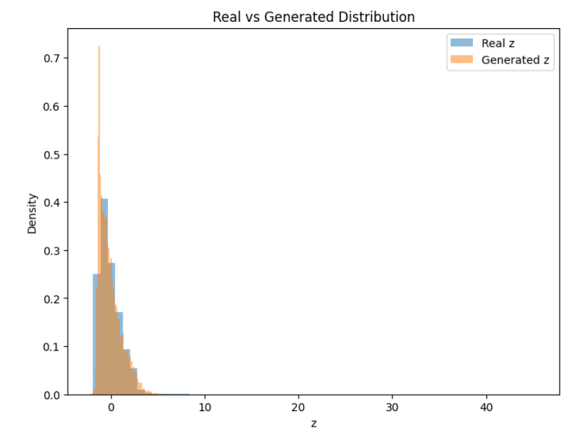
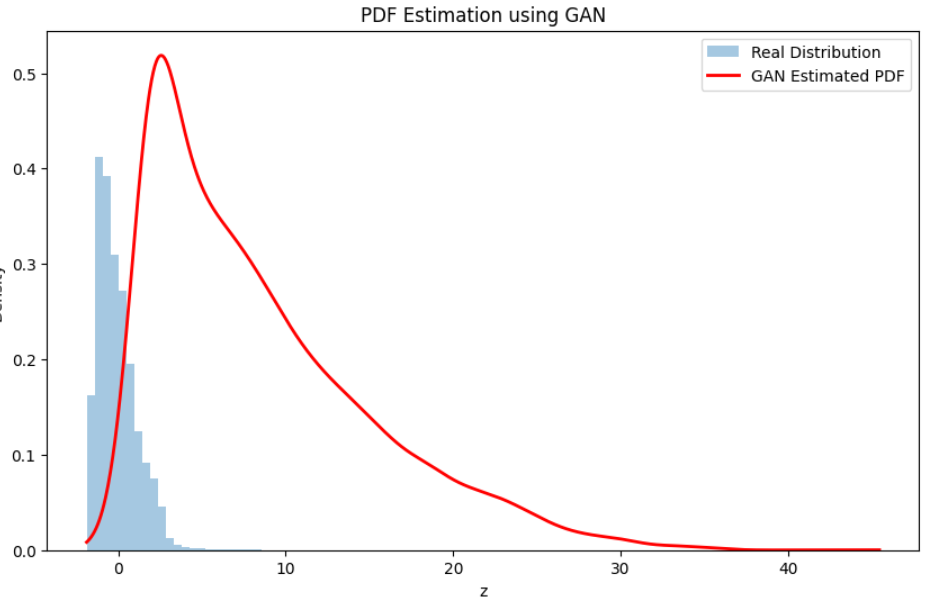

# 📘 Learning Probability Density Function using GAN

**Assignment | Roll No: 102303608**

---

## 🎯 Objective

Learn the unknown probability density function (PDF) of a transformed random variable using only sample data and a **Generative Adversarial Network (GAN)** — no analytical form assumed.

---

## 📂 Dataset

| Detail | Value |
|---|---|
| Source | India Air Quality Data (Kaggle) |
| Column Used | `no2` (Nitrogen Dioxide concentration) |
| Description | Air pollution measurements from monitoring stations across India |

---

## 🔄 Transformation

Each NO₂ value `x` is transformed using:

```
z = T(x) = x + aᵣ · sin(bᵣ · x)
```

Where:
- `aᵣ = 0.5 × (r mod 7)`
- `bᵣ = 0.3 × ((r mod 5) + 1)`

**For Roll No 102303608:**

| Parameter | Calculation | Value |
|---|---|---|
| `r % 7` | `102303608 % 7` | `1` |
| `r % 5` | `102303608 % 5` | `3` |
| `aᵣ` | `0.5 × 1` | `0.5` |
| `bᵣ` | `0.3 × (3 + 1)` | `1.2` |

**Final transformation:**
```
z = x + 0.5 · sin(1.2x)
```

This nonlinear transformation produces a complex, non-Gaussian distribution.

---

## 🏗️ GAN Architecture

### Generator
```
Input (noise, dim=5) → Linear(5, 64) → ReLU
                     → Linear(64, 128) → ReLU
                     → Linear(128, 1)
Output: 1D generated sample z
```

### Discriminator
```
Input (1D sample)    → Linear(1, 128) → LeakyReLU
                     → Linear(128, 64) → LeakyReLU
                     → Linear(64, 1) → Sigmoid
Output: P(real)
```

---

## ⚙️ Training Configuration

| Parameter | Value |
|---|---|
| Noise Dimension | 5 |
| Epochs | 2000 |
| Batch Size | 128 |
| Learning Rate | 0.0005 |
| Optimizer | Adam |
| Loss Function | Binary Cross Entropy (BCE) |

---


## 📁 Project Structure

```
├── assignment.ipynb              # Main training script
├── outputs/
│   ├── kde_generated.png           # KDE estimated PDF from+Histogram of real transformed data
│   ├── real_vs_generated.png       # Distribution comparison
│   └── estimated_pdf.png           # Final estimated PDF
└── README.md
```

---
## 📊 Results

### 1️⃣ PDF Estimation using GAN (Real Histogram + GAN KDE Curve)
Smooth density curve from 10,000 GAN-generated samples.



---

### 2️⃣ Real vs Generated Distribution
Overlay histogram for visual comparison between real and generated samples.



---

### 3️⃣ Estimated PDF from GAN Samples
Final learned probability density function from GAN samples.



### PDF Estimation
After training, **10,000 samples** were drawn from the generator and used to estimate the PDF via:
- Histogram (`density=True`)
- Kernel Density Estimation (KDE)

---

## 📝 Observations

**Mode Coverage**
> The GAN successfully captured the primary peak and right-skewed behavior of the transformed distribution with no major mode collapse.

**Training Stability**
> Loss values oscillated initially but stabilized after sufficient epochs, indicating balanced adversarial training.

**Quality of Generated Distribution**
> Generated samples closely resemble the real distribution. Minor differences exist in extreme tail regions — typical behavior in GAN-based density estimation.

---

## ✅ Conclusion

The GAN effectively learned the **unknown probability density function** of the transformed random variable `z = x + 0.5·sin(1.2x)` without assuming any parametric form. Comparison plots confirm the generator approximates the real data distribution with high fidelity, demonstrating the power of GANs for learning complex, nonlinear distributions purely from data.

---

## 👤 Author

**Roll No:** 102303608  
**Assignment:** Learning PDF using GAN  
**Course:** Probability & Stochastic Processes / ML
